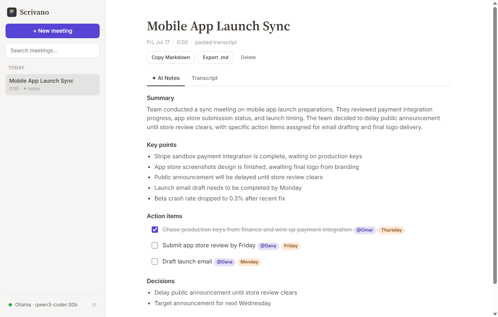

# Scrivano

**Live demo:** https://scrivano.alaasi.dev · **Primary use:** run it locally (below)



## Purpose

Scrivano is a local-first AI meeting-notes app — the Notion AI Notes experience, but
private. It records meetings (or imports audio / pasted transcripts), transcribes them
**on-device** with Whisper, and generates structured AI notes — summary, key points,
action items with owners and due dates, and decisions — using **your own local Ollama
model**. Nothing ever leaves your machine: no accounts, no cloud, no telemetry.

## How the AI works (all local)

| Job | Engine | Where it runs |
|---|---|---|
| Speech-to-text | Whisper via [transformers.js](https://github.com/huggingface/transformers.js) (ONNX, WebGPU/WASM) | In your browser. Model (~75 MB) downloads once, then is cached offline. |
| Summaries, action items, decisions, auto-titles | Any [Ollama](https://ollama.com) model you've pulled | On your machine at `localhost:11434`. |

## Features

- **Four capture modes:** record your microphone; record a meeting tab (browser Zoom/
  Meet — captures tab audio *mixed with* your mic); upload an audio file; or paste an
  existing transcript
- **On-device transcription** with timestamps, live progress for both model download
  and transcription, and a choice of Whisper sizes (tiny / base / small) in Settings
- **AI notes** in Notion's structure: one-paragraph summary, key points, action items
  (with `@owner` and due pills, checkbox state that persists), and decisions — plus
  automatic meeting titling
- **Notion-style dashboard:** sidebar with date-grouped meetings (Today / Yesterday /
  This week / Earlier), full-text search across titles, summaries, and transcripts,
  tabbed AI Notes / Transcript views, editable titles
- **Ollama-aware:** detects whether Ollama is running, lists your installed models in
  a picker, and shows setup guidance when offline — transcription works fully without it
- **Export** any meeting as Markdown (copy or `.md` download)
- Everything stored in IndexedDB on your machine

## Run it locally (recommended)

```bash
git clone https://github.com/AbdulrahmanAlaasi/scrivano.git
cd scrivano
npm install
npm run dev        # open http://localhost:5173
```

### Set up Ollama (for AI notes)

1. Install Ollama from [ollama.com](https://ollama.com)
2. Pull a model — `llama3.2` (2 GB) is a great default; `qwen2.5:7b` is stronger if you
   have the RAM:
   ```bash
   ollama pull llama3.2
   ```
3. Make sure Ollama is running (`ollama serve`, or the desktop app). Scrivano detects it
   automatically — the status pill in the sidebar footer turns green.

> **Using the hosted demo instead?** Browsers block a website from calling your local
> Ollama unless Ollama allows the origin. Start Ollama with:
> `OLLAMA_ORIGINS=https://scrivano.alaasi.dev ollama serve`
> (on Windows PowerShell: `$env:OLLAMA_ORIGINS="https://scrivano.alaasi.dev"; ollama serve`).
> Transcription works on the demo with no setup at all.

## Testing

```bash
npm test
```

36 unit tests cover the correctness-critical core: transcript flattening and middle-out
trimming for long meetings, prompt construction, robust JSON extraction from imperfect
local-model output (markdown fences, surrounding prose, braces inside strings), notes
parsing with tolerant field aliases (`task`/`assignee`/`deadline`), title sanitization,
duration/date-group formatting, search, Markdown export (including checked action
items), and segment merging.

## Architecture

- `src/shared/notesEngine.ts` — pure prompt builders + response parsers. Local models
  often disobey "JSON only", so `extractJsonObject` does a string-aware brace walk to
  recover the object from fenced or prose-wrapped responses, and the parser tolerates
  alternate field names and drops malformed entries instead of failing the whole parse.
- `src/shared/format.ts` — pure formatting: durations, date grouping, search, Markdown
  export, segment merging.
- `src/lib/transcriber.ts` — lazy-loads transformers.js on first use; decodes any
  browser-supported audio to 16 kHz mono PCM via `OfflineAudioContext`, then transcribes
  in 28-second windows with per-chunk progress.
- `src/lib/recorder.ts` — MediaRecorder wrapper; tab-audio mode mixes `getDisplayMedia`
  audio with the mic through the Web Audio API so both sides of a call are captured.
- `src/lib/ollama.ts` — tiny client for `/api/tags` (detection + model list) and
  `/api/generate`.
- `src/lib/db.ts` — IndexedDB stores for meetings and settings.
- `src/main.ts` — the workspace shell (sidebar + views) as a small state machine.
- `src/style.css` — Notion's design language: `#37352f` charcoal ink, `#f6f5f4` sidebar,
  purple `#5645d4` primary, pastel capture cards; Inter UI with Source Serif 4 titles.

## Verified end-to-end

The full flow was verified against a **real local model** (`qwen3-coder:30b` via
Ollama): pasted a realistic staff-meeting transcript → generated notes correctly
extracted all three action items with the right owners and due mentions, both
decisions, and auto-titled the meeting — then survived a full page reload from
IndexedDB, checkbox state included.

## Privacy & security

- No network calls except: Google Fonts (UI), one-time Whisper model download from
  Hugging Face, and your own `localhost:11434`. A strict CSP enforces exactly that list.
- All user text is escaped before rendering; nothing is ever transmitted to any server.

## Current limitations

- Transcription is batch (after recording stops), not live-streaming captions.
- English-optimized defaults (`whisper-tiny.en` option is English-only; base/small are
  multilingual).
- No speaker diarization — segments are timestamped but not attributed to speakers.
- Browser-tab capture requires a Chromium browser (`getDisplayMedia` audio).

## Future improvements

- Live streaming transcription with rolling AI notes during the meeting.
- Speaker diarization.
- Ask-your-meeting chat (RAG over past transcripts with local embeddings).
- Obsidian/Notion export integrations.

## Professional skills demonstrated

Local-model integration (Ollama REST + defensive parsing of imperfect LLM output),
on-device ML inference (Whisper via ONNX/WASM with chunked processing and progress
reporting), Web Audio (recording, mixing display+mic streams, offline resampling),
IndexedDB persistence, and privacy-first product architecture.
